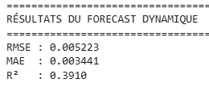
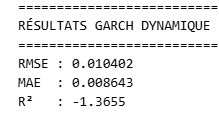

# Mesure et gestion du risque des portefeuilles OPCVM à l’aide de la Data Science

## **Table of content**

- [Video demo](#Video-demo)
- [Description du projet](#description-du-projet)
- [Méthodologie de prévision dynamique de la volatilité](#méthodologie-de-prévision-dynamique-de-la-volatilité)
- [Architecture globale du projet](#architecture-globale-du-projet)
- [Résultats](#Résultats)
- [Quelques définitions](#Quelques-définitions)


## **Video demo**

<video src="https://github.com/user-attachments/assets/ecf7bdab-c388-42e0-941f-958963e7cf0d" controls width="600">
  Your browser does not support the video tag.
</video>

## **Description du projet**

Le secteur de la gestion d’actifs, et en particulier celui des OPCVM (Organismes de Placement Collectif en Valeurs Mobilières), est confronté à des défis majeurs en matière de **gestion du risque financier**. Les risques de marché, de liquidité et de volatilité peuvent impacter significativement la performance des fonds et, par conséquent, les intérêts des investisseurs. De plus, les méthodes traditionnelles d’évaluation du risque (VaR, CVaR, volatilité historique) peuvent s’avérer insuffisantes pour anticiper des événements extrêmes ou des corrélations dynamiques entre actifs.

Ce projet a pour objectif de **développer une approche data-driven pour mesurer, prédire et gérer le risque d’un portefeuille OPCVM**, en exploitant les techniques avancées de la Data Science et de l’intelligence artificielle. Plus spécifiquement, le projet vise à **Estimer précisément la volatilité sur 2 semaines** de l'**OPCVM Attijari diversifié** portefeuille, en combinant méthodes classiques GARCH, volatilité historique, et modèles d’apprentissage automatique (Random Forests, XGBoost) pour anticiper les fluctuations futures du fond.


Ce projet représente une opportunité concrète de **moderniser la gestion du risque dans les OPCVM** en intégrant l’analyse avancée de données et la prévision des risques financiers, tout en améliorant la prise de décision et la transparence pour les investisseurs.

## **Méthodologie de prévision dynamique de la volatilité**

## A. Principe général

Dans le cadre de ce projet, nous avons développé une approche data-driven visant à estimer et prévoir la volatilité à deux semaines de l’OPCVM *Attijari Diversifié*, en combinant des méthodes économétriques classiques (GARCH) et des modèles avancés d’apprentissage automatique.

Contrairement aux approches traditionnelles reposant sur un entraînement statique, nous avons mis en place un **système de prévision dynamique avec ré-entraînement automatique**, reproduisant fidèlement les conditions réelles de marché.

Cette approche repose sur un modèle XGBoost entraîné de manière itérative, capable d’intégrer progressivement les informations nouvellement prédites afin d’améliorer la cohérence temporelle des prévisions multi-horizons.

---

## B. Feature Engineering et construction de l’espace explicatif


### B.1 Lags de la volatilité future

**(vol_future_2w_1, vol_future_2w_2, vol_future_2w_3)**

Ces variables correspondent aux valeurs retardées de la volatilité future estimée.
Elles modélisent la **mémoire et la persistance de la volatilité**, deux caractéristiques fondamentales des marchés financiers.

Elles constituent l’équivalent non-linéaire, au sein d’un modèle machine learning, de la composante ARCH/GARCH, tout en permettant la détection de changements de régimes de marché.

---

### B.2 Performances glissantes sur 1 semaine

*(Rendement hebdomadaire de l’OPCVM Attijari Diversifié)*

Cette variable reflète la dynamique récente de performance du fonds.
Elle permet de capturer l’effet de momentum et les phases de stress du marché, qui influencent fortement le niveau de volatilité futur.

---

### B.3 Rendement retardé (rendement_lag_1)

Il s’agit du rendement de l’OPCVM décalé d’une période.
Cette variable introduit explicitement dans le modèle l’**effet d’asymétrie (leverage effect)**, selon lequel les baisses de marché génèrent généralement plus de volatilité que les hausses de même amplitude.

---

### B.4 Variation hebdomadaire du MASI

*(Variation %)*

Cette variable représente la variation hebdomadaire de l’indice MASI.
Elle agit comme un indicateur de stress systémique du marché marocain, permettant au modèle d’intégrer l’environnement macro-financier global dans ses prévisions.

---

### B.5 Volatilité GARCH de l’OPCVM

*(garch_vol)*

La volatilité estimée par un modèle GARCH est intégrée comme variable explicative, et non comme unique moteur de prévision.
Cela permet au modèle XGBoost d’apprendre à corriger les biais structurels de GARCH, en exploitant sa capacité à modéliser des relations non linéaires et des effets d’interaction.

---

## C. Fonction de prévision dynamique avec ré-entraînement

La fonction `dynamic_forecast_with_retraining()` implémente un mécanisme de **forecast récursif auto-apprenant** :

1. Les observations historiques pour lesquelles la volatilité future à 2 semaines est connue sont utilisées pour constituer l’échantillon d’apprentissage initial.
2. Les périodes futures, pour lesquelles la volatilité est inconnue, sont prédites une à une.
3. Après chaque prédiction, la valeur estimée est injectée dans le jeu de données.
4. Les variables retardées (lags) sont mises à jour.
5. Le modèle est ré-entraîné avant de passer à la période suivante.

Ce mécanisme permet de simuler un contexte réel de marché, dans lequel le modèle est continuellement mis à jour à mesure que de nouvelles informations deviennent disponibles.

---

## D. Apport méthodologique

Cette architecture hybride permet de construire un **moteur de prévision de la volatilité non linéaire, adaptatif et multi-facteurs**, capable de :

* capturer les régimes de marché,
* intégrer les chocs macro-financiers,
* modéliser la persistance et l’asymétrie de la volatilité,
* et ajuster continuellement ses paramètres.

Les résultats obtenus démontrent une amélioration significative des performances prédictives par rapport aux approches économétriques classiques, confirmant la pertinence de l’intégration de l’intelligence artificielle dans la gestion du risque des OPCVM.

---


## Architecture globale du projet

```
┌─────────────────────────────────────────────────────────────────┐
│                  ACQUISITION (SCRAPING)                         │
├─────────────────────────────────────────────────────────────────┤
│ Investing.com (MASI)  →  weekly_masi_scraper  →  CSV weekly     │
│ Wafa Gestion (OPCVM)  →  weekly_opcvm_scraper  →  CSV weekly    │
│ Import manuel (Historique)  →  Moroccan All Shares.csv          │
└─────────────────────────────────────────────────────────────────┘
                              ↓
┌─────────────────────────────────────────────────────────────────┐
│                  NETTOYAGE (CLEANING)                           │
├─────────────────────────────────────────────────────────────────┤
│ dataset_cleaning.ipynb                                          │
│ → MASI_cleaned.csv                                              │
│ → attijari_diversifie.csv                                       │
└─────────────────────────────────────────────────────────────────┘
                              ↓
┌─────────────────────────────────────────────────────────────────┐
│              TRANSFORMATION & FEATURES (PROCESSING)             │
├─────────────────────────────────────────────────────────────────┤
│ dataset_processing.py                                           │
│ 1. Fusion MASI quotidien + hebdomadaire                         │
│ 2. Calcul GARCH volatility                                      │
│ 3. Feature engineering (lags, performances)                     │
│ → final_dataset.csv (prêt pour ML)                              │
└─────────────────────────────────────────────────────────────────┘
                              ↓
┌─────────────────────────────────────────────────────────────────┐
│              MODÉLISATION (ML TRAINING)                         │
├─────────────────────────────────────────────────────────────────┤
│ modelling.py                                                    │
│ Algo: Dynamic Forecast with XGBoost Retraining                  │
│ Target: vol_future_2w (volatilité 2 semaines)                   │
│ → volatility_forecasted_dataset.csv                             │
└─────────────────────────────────────────────────────────────────┘
                              ↓
┌─────────────────────────────────────────────────────────────────┐
│                  API (BACKEND FASTAPI)                          │
├─────────────────────────────────────────────────────────────────┤
│ backend/main.py                                                 │
│ Endpoints:                                                      │
│ GET  /api/final/opcvm_liquidative         → Valeur Liquidative  │
│ GET  /api/final/masi_weekly_mean          → MASI hebdo          │
│ POST /api/volatility/run-modelling        → Lance modelling.py  │
│ GET  /api/volatility/forecast             → Dernière prédiction │
└─────────────────────────────────────────────────────────────────┘
                              ↓
┌─────────────────────────────────────────────────────────────────┐
│              DASHBOARD (FRONTEND NEXT.JS)                       │
├─────────────────────────────────────────────────────────────────┤
│ react-financial-app/                                            │
│ • Affichage des séries temporelles (MASI, OPCVM)                │
│ • Graphiques Recharts (données hebdomadaires)                   │
│ • Bouton "Prédire la volatilité" → appel /run-modelling         │
│ • Affichage des prédictions XGBoost                             │
│ • Vue: Financial Dashboard (Vercel URL)                         │
└─────────────────────────────────────────────────────────────────┘
```

## **Résultats**

**Résultats approche ML**



**Résultats approche Traditionnel Garch**



**Comparaison**

Les résultats montrent que le modèle de forecast dynamique **surpasse largement le GARCH** :

* RMSE : 0.0052 contre 0.0104
* MAE  : 0.0034 contre 0.0086
* R²   : 0.3910 contre -1.3655


## **Quelques définitions**


- Un **OPCVM** (Organisme de Placement Collectif en Valeurs Mobilières) est un fonds qui permet à plusieurs investisseurs de **mettre en commun leur argent** pour qu’un gestionnaire professionnel investisse ce capital dans un **panier diversifié de titres financiers** (actions, obligations, etc.). L’objectif est de **diversifier le risque** et de **faciliter l’accès aux marchés financiers** pour les particuliers.
- **Attijari Diversifié** est un **OPCVM** géré par Attijariwafa Bank qui investit dans un **panier varié d’instruments financiers** (actions, obligations, et autres actifs) afin de **diversifier le risque** et chercher un **équilibre entre rendement et sécurité** pour les investisseurs.
- **Risque de marché**: le risque de marché correspond à la **perte potentielle due aux variations des prix des actifs financiers** dans le portefeuille, comme les actions, obligations ou devises. C’est le risque lié aux **mouvements généraux** du marché.
- **Risque de liquidité**: Le risque de liquidité correspond à la **difficulté de vendre un actif rapidement sans affecter son prix.** Il devient critique si l’OPCVM doit rembourser des investisseurs mais que certains actifs ne peuvent pas être liquidés facilement.
- **Volatilité**: La volatilité mesure la **dispersion des rendements autour de leur moyenne.** Plus la volatilité est élevée → plus le portefeuille est risqué.
- **Risque de volatilité**: Le risque de volatilité correspond à la **grande variation des prix d’un actif ou d’un portefeuille sur une période donnée.** Une forte volatilité augmente l’incertitude sur le rendement futur.


Ces indicateurs montrent que le modèle prédit **plus précisément la volatilité future** et capture mieux la variation des données, contrairement au GARCH dont les prédictions sont moins fiables et moins adaptées à ce dataset.


